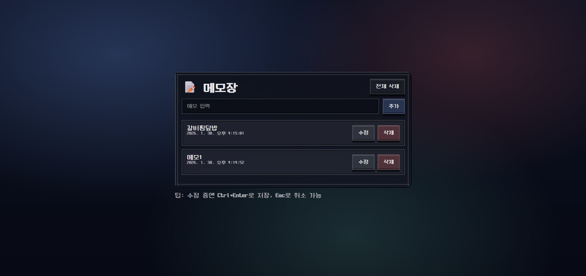

# 📝 픽셀 메모장 (Memo App)

React + TypeScript + Vite 기반으로 제작한  
레트로 스타일 메모장 웹 앱입니다.

둥근모체 폰트와 8비트 프레임 UI, 픽셀 버튼을 적용해  
게임 메뉴 같은 느낌의 인터페이스를 구현했습니다.

## 🌐 배포 주소

Vercel을 통해 배포되었습니다.

👉 https://memo-app-steel.vercel.app/

---

## ✨ 주요 기능

### 메모

- 메모 추가
- 메모 수정
- 메모 삭제
- 전체 삭제

### 저장

- localStorage 자동 저장
- 새로고침 후에도 메모 유지

### 키보드 단축키

- `Enter` : 메모 추가
- `Ctrl + Enter` / `Cmd + Enter` : 수정 저장
- `Esc` : 수정 취소

### UI

- 8비트 스타일 카드 프레임
- 픽셀 버튼 디자인
- 둥근모체(NeoDunggeunmo) 적용
- Hover 반사광 효과

---

## 🛠 사용 기술

- React
- TypeScript
- Vite
- CSS (커스텀 픽셀 UI)
- Web Storage (localStorage)

---

## 📂 프로젝트 구조

```
memo-app/
├─ src/
│ ├─ App.tsx
│ ├─ main.tsx
│ └─ index.css
├─ public/
├─ index.html
├─ package.json
├─ package-lock.json
├─ vite.config.ts
├─ tsconfig.json
└─ README.md
```

---

## 🚀 실행 방법

npm install
npm run dev
브라우저 접속:

http://localhost:5173

💾 데이터 저장
메모 데이터는 브라우저 localStorage에 저장됩니다.

const STORAGE_KEY = "memo-app:memos";

🎮 UI 컨셉

- 레트로 게임 메뉴 스타일

- 8비트 프레임 카드

- 픽셀 버튼

- 둥근모체 폰트

📸 미리보기


📌 앞으로 추가해보고 싶은 기능
메모 검색

- 즐겨찾기(핀 고정)

- 메모 색상 태그

- 애니메이션

- 버튼 사운드 효과

🙋‍♀️ 제작자
GitHub: https://github.com/sungminjung066-lang
